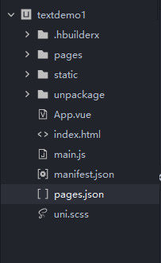

# 项目目录和文件作用

## 介绍项目目录和文件作用

`pages.json` 文件用来对 uni-app 进行全局配置，决定页面文件的路径、窗口样式、原生的导航栏、底部的原生 tabbar 等

`manifest.json` 文件是应用的配置文件，用于指定应用的名称、图标、权限等。

`App.vue`是我们的跟组件，所有页面都是在`App.vue`下进行切换的，是页面入口文件，可以调用应用的生命周期函数。

`main.js`是我们的项目入口文件，主要作用是初始化`vue`实例并使用需要的插件。

`uni.scss`文件的用途是为了方便整体控制应用的风格。比如按钮颜色、边框风格，`uni.scss`文件里预置了一批 scss 变量预置。

`unpackage` 就是打包目录，在这里有各个平台的打包文件

`pages` 所有的页面存放目录

`static` 静态资源目录，例如图片等

`components` 组件存放目录

## 多端兼容

为了实现多端兼容，综合考虑编译速度、运行性能等因素，`uni-app` 约定了如下开发规范：

- 页面文件遵循 [Vue 单文件组件 (SFC) 规范](https://vue-loader.vuejs.org/zh/spec.html)

- 组件标签靠近小程序规范，详见[uni-app 组件规范](https://uniapp.dcloud.io/component/README)

- 接口能力（JS API）靠近微信小程序规范，但需将前缀 `wx` 替换为 `uni`，详见[uni-app 接口规范](https://uniapp.dcloud.io/api/README)

- 数据绑定及事件处理同 `Vue.js` 规范，同时补充了 App 及页面的生命周期

- 为兼容多端运行，建议使用 flex 布局进行开发
