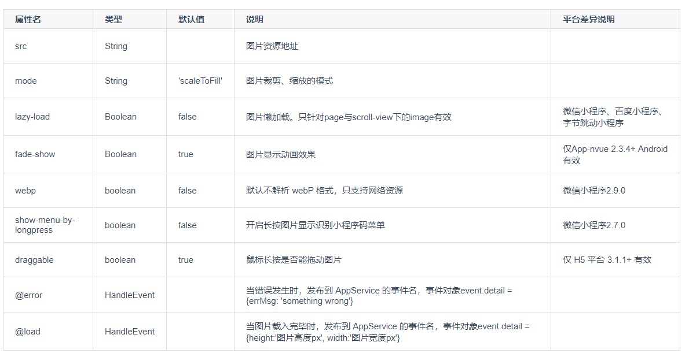
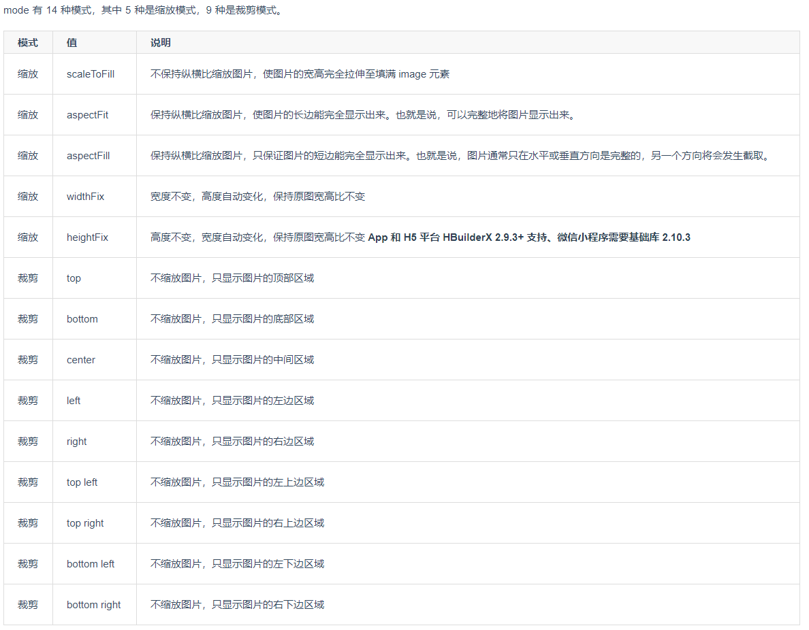

# image 组件的使用

## 属性

图片。

| 属性名 | 类型   | 默认值        | 说明                 | 平台差异说明 |
| ------ | ------ | ------------- | -------------------- | ------------ |
| src    | String |               | 图片资源地址         | ---          |
| mode   | String | 'scaleToFill' | 图片裁剪、缩放的模式 | ---          |

**Tips**

- `<image>` 组件默认宽度 300px、高度 225px；

- `src` 仅支持相对路径、绝对路径，支持 base64 码；

- 页面结构复杂，css 样式太多的情况，使用 image 可能导致样式生效较慢，出现 “闪一下” 的情况，此时设置 `image{will-change: transform}` ,可优化此问题。

## 缩放属性

