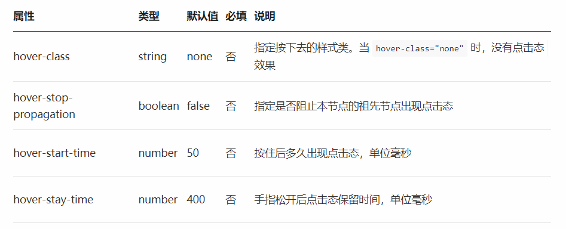

# View 组件的用法

## view 视图容器组件的用法

> View 视图容器， 类似于 HTML 中的 div

## 001 - 组件的属性



###### 002 - 代码案例

```html
<view class="box2" hover-class="box2_active">
  <view
    class="box1"
    hover-class="active"
    hover-stop-propagation
    :hover-start-time="2000"
    :hover-stay-time="2000"
  >
  </view>
</view>
```
